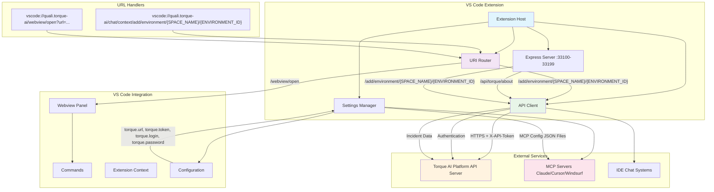

# Torque AI

[](https://github.com/doppleware/torque-vscode-extension/releases)
[](https://github.com/doppleware/torque-vscode-extension/actions/workflows/ci.yml)

For more info check out our [website](https://quali.com)

## Architecture

The Torque AI VS Code extension provides a comprehensive integration between VS Code and the Torque AI platform.



### Core Components

#### 1. Extension Host (`src/extension.ts`)

- **Activation**: Triggered on VS Code startup (`onStartupFinished`)
- **Express Server**: Runs on dynamic port (33100-33199) for external API communication
- **URI Handler**: Registers `vscode://quali.torque-ai/` scheme for deep linking
- **Configuration Monitoring**: Watches for setting changes and reinitializes services

#### 2. URI Router (`src/uris/UriRouter.ts`)

- **Pattern Matching**: Uses `path-to-regexp` for flexible route definitions
- **Parameter Extraction**: Supports path parameters (`:id`) and query strings
- **Error Handling**: Graceful error handling with user notifications

**Supported Routes:**

- `/chat/context/add/file/incident/:incidentId` - Attach incident data to chat context
- `/webview/open?url=<url>` - Open secure webview with domain validation

#### 3. API Client (`src/api/ApiClient.ts`)

- **Authentication**: Token-based auth with automatic refresh using refresh tokens
- **Service Architecture**: Modular services (Authentication, Agentic)
- **Request Interceptors**: Automatic token refresh and error handling
- **HTTPS Support**: Self-signed certificate support for development

#### 4. Settings Manager (`src/SettingsManager.ts`)

- **Multi-Scope Support**: Global, workspace, and workspace folder configurations
- **Secret Storage**: Secure storage for sensitive credentials
- **Change Detection**: Tracks configuration scope changes
- **MCP Integration**: Automatic MCP server configuration when enabled

#### 5. Express Server Integration

- **Health Endpoint**: `/api/torque/about` - Extension and workspace information
- **Chat Context API**: `/add/environment/{SPACE_NAME}/{ENVIRONMENT_ID}` - External environment attachment
- **CORS Support**: Cross-origin requests for web integration

### Data Flow

1. **External Trigger**: Web application or CLI calls `vscode://quali.torque-ai/` URL
2. **URI Processing**: UriRouter matches pattern and extracts parameters
3. **API Communication**: ApiClient authenticates and fetches data from Torque platform
4. **File Generation**: Environment data written to temporary JSON file
5. **IDE Integration**: VS Code commands open chat and attach file context
6. **User Notification**: Success/error feedback via VS Code notifications

### Security Features

- **Domain Validation**: Webview URLs must match configured API domain
- **Token Management**: Secure token storage and automatic refresh
- **HTTPS Enforcement**: All API communication over HTTPS
- **Scope Isolation**: Settings can be configured at different VS Code scopes

## URL Handler Integration

The extension registers the `vscode://quali.torque-ai/` URI scheme to enable deep linking from external applications, web interfaces, and command-line tools.

### Usage Examples

#### 1. Attach Environment Details to Chat Context

```bash
# From command line
open "vscode://quali.torque-ai/chat/context/add/file/incident/abc123"

# From web application
window.location.href = "vscode://quali.torque-ai/chat/context/add/file/incident/abc123"
```

This will:

1. Fetch environment data from the Torque API using the provided incident ID
2. Generate a temporary JSON file with the environment details
3. Automatically open VS Code's chat interface
4. Attach the environment file to the chat context for AI analysis

#### 2. Open Secure Webview

```bash
# Open webview with domain validation
open "vscode://quali.torque-ai/webview/open?url=https://app.torque.example.com/dashboard"
```

This will:

1. Validate that the URL matches the configured API domain
2. Create a new webview panel in VS Code
3. Load the specified URL in a secure iframe
4. Display appropriate error messages for invalid URLs

### Integration Patterns

#### Web Application Integration

```javascript
// Check if VS Code is available
function openInVSCode(incidentId) {
  const url = `vscode://quali.torque-ai/chat/context/add/environment/{SPACE_NAME}/{ENVIRONMENT_ID}`;

  // Attempt to open in VS Code
  window.location.href = url;

  // Fallback: show instructions
  setTimeout(() => {
    showVSCodeInstructions(url);
  }, 1000);
}
```

### Error Handling

The URL handler provides comprehensive error handling:

- **Authentication Errors**: Displays login prompts if API credentials are missing
- **Network Errors**: Shows connection error messages with retry options
- **Invalid URLs**: Validates webview URLs against configured domains
- **Missing Incidents**: Handles API 404 responses gracefully
- **File System Errors**: Manages temporary file creation failures

### Security Considerations

- **Domain Whitelist**: Webview URLs must match the configured `torque.url` domain
- **Token Validation**: All API requests include authentication tokens
- **Temporary Files**: Incident data files are created in secure temp directories
- **Input Sanitization**: All URL parameters are properly decoded and validated

## Extension settings

This extension contributes the following settings:

| Key            | Type   | Default                  | Description |
| -------------- | ------ | ------------------------ | ----------- |
| `torque.url`   | string | `https://localhost:5051` | API URL     |
| `torque.token` | string | -                        | API token   |

## Build

```shell
npm ci
vsce package
```

## License

[MIT](/LICENSE)
